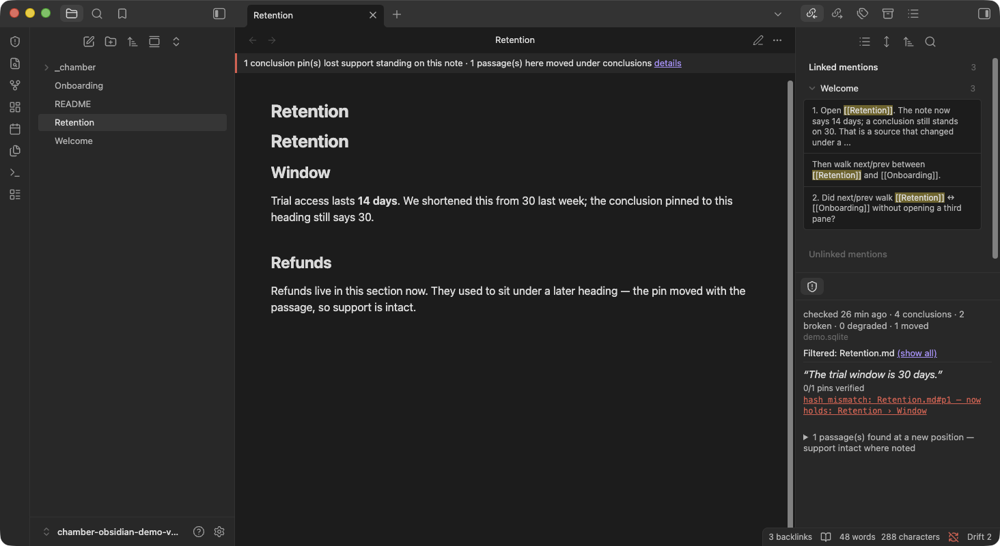
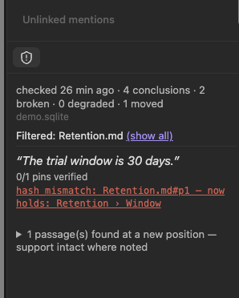

# Chamber Drift

Shows which of your conclusions lost support when the notes under them changed.

Chamber Drift is the Obsidian-side half of [Chamber](https://github.com/abm9111/chamber). Chamber's `verify` command hashes the passages a belief is pinned to and reports when one no longer says what it said at pin time; this plugin renders that report inside your vault. It does not run any check itself — see [What it will not do](#what-it-will-not-do).

That is the same failure people hit as Sync history, a renamed heading under an embed, a deleted source, or two devices writing the report: a conclusion outlived its evidence. Chamber names the cause. It does not become a second Sync, a Bases formula, or a broken-links crawler.

## Try it in two minutes

You do not need Chamber installed for this.

1. Download [`chamber-drift-demo-vault.zip`](https://github.com/abm9111/chamber-obsidian/releases/latest) from the latest release, or clone this repo and use the [`demo/`](demo/) folder.
2. In Obsidian: **Open folder as vault** → that unzipped folder (or `demo/`). Not the plugin repository root — the plugin looks for `_chamber/report.json` at the vault root.
3. Settings → Community plugins → Browse → search **Chamber Drift** → Install → Enable. Listing: [community.obsidian.md/plugins/chamber-drift](https://community.obsidian.md/plugins/chamber-drift).
4. Open `Retention.md`. The note says 14 days; a conclusion still stands on 30. Click the banner, then try search / next-prev / the status bar.

The JSON in the demo is canned so you can judge the UI. The real loop (pin beliefs, schedule `verify --json` into your own vault) is [Setup](#setup) below. Testers: three questions live in `demo/Welcome.md` and on [Discussions](https://github.com/abm9111/chamber-obsidian/discussions).

## What it shows

Chamber Drift reads one file — the JSON report your own scheduled `chamber verify --json` writes into the vault (see [Setup](#setup)) — and renders it in two places. Nothing here calls Chamber, reaches the network, or writes to your vault; it only parses and displays a report that already exists on disk.

**The drift panel.** Open it from the ribbon icon (a shield-alert icon, tooltip "Chamber Drift") or the command "Open drift panel". The header shows when the report was checked, how many conclusions it covers, and counts of broken, degraded, and moved pins, plus a staleness warning once the report is older than your configured threshold. Each drifted conclusion appears as an excerpt of the belief with one chip per broken pin — `hash_mismatch: <ref> — now holds: <title>` when the cited passage has been edited or shifted underneath it, `not_found: minted against <ref> — whatever is there now is not what was cited` when the exact text a code citation pinned to no longer exists anywhere in the file. Relocated passages (moved, not broken — support is intact) and files gone from disk are shown as their own collapsed info sections rather than alarms, mirroring Chamber's own alarm/info split. A ref the plugin can't map onto a file in this vault is labeled "(outside this vault)" instead of guessed at.

**The note banner.** A quiet strip that appears only on notes with drifted or moved pins standing on them. Healthy notes get nothing — a healthy belief's report entry carries no refs to point a banner at, so a reassuring banner on a clean note would be UI for data that doesn't exist. Click the banner to jump into the panel, filtered to that note.

**Desktop status bar.** When there is something to say, the status bar shows `Drift 3` (drifted conclusions), `Drift stale` (report older than the threshold), or `Drift gone` (pinned files missing from disk). Click it to open the panel. A clean, fresh report shows nothing there — same silence-on-healthy rule as the banner.

**Command palette (desktop and mobile).** "Search drifted conclusions" is a fuzzy jump list of broken beliefs. "Open next/previous drifted note" walks the review queue without opening another pane. "Copy drifted note wikilinks" puts `[[paths]]` on the clipboard for a Base or Dataview review table — the plugin still does not write those links into any note.

**Device truth.** The transport is a file, and files lie per-device. The panel names the specific transport failure instead of one generic "unreadable": a report that exists but is **empty** (an iCloud placeholder that was never downloaded), a report that opens like JSON but never closes (**torn mid-write** by a sync engine), **sync-conflict copies** sitting next to the report (two machines writing it — Syncthing's `.sync-conflict-*`, "conflicted copy" names), and a report that goes **backwards** (an older `generatedAt` replacing a newer one, the racing-writers signature). While the file on disk is bad, the last report that loaded cleanly on this device keeps the panel, status bar, note banner, search, and next/prev commands working — the panel labels that copy as last-good rather than flashing to an error mid-sync. And when a newer report lands more than 30 minutes after it was generated, the panel says sync carried it late — that's a different fix than a stopped verify job.

## Setup

Chamber Drift never runs `chamber` itself. You schedule `chamber verify --json` outside Obsidian, writing its output atomically into the vault; the plugin only watches the file that lands there:

```
chamber verify --json > "<vault>/_chamber/.report.tmp" ; [ -s "<vault>/_chamber/.report.tmp" ] && mv "<vault>/_chamber/.report.tmp" "<vault>/_chamber/report.json"
```

The `[ -s … ]` guard moves the temp file only when it's non-empty — so a run that silently produces nothing (wrong `PATH` under launchd, `chamber` missing) never clobbers the last good report — and it isn't `&&` because `verify` exits 1 exactly when it finds drift, which `&&` would treat as failure and discard the one report you actually need to see.

The temp file sits next to its destination rather than in `/tmp` — `mv` is only atomic within a single filesystem, and `/tmp` is routinely a different one, which turns `mv` into copy-then-unlink and reintroduces exactly the half-written read this line exists to prevent. Replace `<vault>` with your vault's real filesystem path; neither launchd nor cron expand it for you.

Default report path is `_chamber/report.json`, configurable in settings. The leading underscore, not a dot, is deliberate: Obsidian's vault index ignores dot-folders, so a dot-prefixed path gets no file-change events at all and falls back to a 30-second poll instead of updating live.

**The scheduled job needs `chamber ingest`, not just `chamber verify`.** `verify` only compares against what's already indexed — without a recurring `ingest`, the database never learns a note changed, and the panel stays green while citations quietly drift underneath it. Run `ingest` unconditionally ahead of `verify`, never `ingest && verify`: an `ingest` failure (a moved root, an unmounted volume) must not silently skip the check that matters.

**launchd** (macOS), every 15 minutes — save as `~/Library/LaunchAgents/com.chamber.verify-obsidian.plist`. Filename and `Label` are `-obsidian`-suffixed on purpose: chamber's own daily notification job already owns the plain `com.chamber.verify` label (`deploy/launchd/com.chamber.verify.plist` in the chamber repo), and loading this job under that same label would silently replace it instead of adding a second one. The shell is `/bin/sh -lc`, a login shell, not `-c` — launchd's own default `PATH` excludes `/usr/local/bin` and `/opt/homebrew/bin`, so a bare `-c` can't find an npm-installed `chamber`, which is exactly the "wrong PATH" failure the `[ -s … ]` guard above exists to survive:

```xml
<?xml version="1.0" encoding="UTF-8"?>
<!DOCTYPE plist PUBLIC "-//Apple//DTD PLIST 1.0//EN" "http://www.apple.com/DTDs/PropertyList-1.0.dtd">
<plist version="1.0">
<dict>
  <key>Label</key><string>com.chamber.verify-obsidian</string>
  <key>ProgramArguments</key>
  <array>
    <string>/bin/sh</string>
    <string>-lc</string>
    <!-- && is XML-escaped below: a raw & inside a plist <string> is invalid
         XML and launchd refuses the whole file. The escaped form round-trips
         to the exact one-liner above, with the ingest step chained ahead of it. -->
    <string>chamber ingest || echo "!! ingest FAILED (exit $?) - verifying against the corpus as it stands, which may be stale"; chamber verify --json > "/Users/you/Vault/_chamber/.report.tmp" ; [ -s "/Users/you/Vault/_chamber/.report.tmp" ] &amp;&amp; mv "/Users/you/Vault/_chamber/.report.tmp" "/Users/you/Vault/_chamber/report.json"</string>
  </array>
  <key>StartInterval</key><integer>900</integer>
  <key>StandardOutPath</key><string>/Users/you/Library/Logs/chamber-verify-obsidian.log</string>
  <key>StandardErrorPath</key><string>/Users/you/Library/Logs/chamber-verify-obsidian.log</string>
</dict>
</plist>
```

Load it with `launchctl load ~/Library/LaunchAgents/com.chamber.verify-obsidian.plist`. A separate label from `com.chamber.verify` is deliberate — that job's desktop notification and this job's vault write are different consumers of the same `verify`, and one must not silently replace the other.

**cron**, every 15 minutes — same shape, same reasons, wrapped the same way so the job gets a real `PATH` on Linux too:

```cron
*/15 * * * * /bin/sh -lc 'chamber ingest || echo "!! ingest FAILED (exit $?) - verifying against the corpus as it stands, which may be stale"; chamber verify --json > "/Users/you/Vault/_chamber/.report.tmp" ; [ -s "/Users/you/Vault/_chamber/.report.tmp" ] && mv "/Users/you/Vault/_chamber/.report.tmp" "/Users/you/Vault/_chamber/report.json"' >> "$HOME/.local/state/chamber-verify-obsidian.log" 2>&1
```

Create the log directory first (`mkdir -p ~/.local/state`) — a redirect into a directory that doesn't exist fails silently, and cron mails the error to a mailbox nobody reads.

`chamber ingest` re-walks and re-embeds everything under the configured root on every run, not just what changed, so it's the expensive half of this job — unremarkable at 15 minutes for a personal vault; split the schedule (coarser `ingest`, tighter bare-`verify` one-liner) if it gets slow enough to notice. Full reasoning for the login shell, running `ingest` unconditionally rather than `ingest && verify`, and the `%`-in-crontab trap lives in chamber's [`docs/OBSIDIAN.md`](https://github.com/abm9111/chamber/blob/main/docs/OBSIDIAN.md) and [`deploy/SCHEDULING.md`](https://github.com/abm9111/chamber/blob/main/deploy/SCHEDULING.md) — read once there rather than let a second copy here drift out of sync with it.

Either way, `chamber index-code` needs to have run too for any code citations, and beliefs need to be pinned (`chamber believe`) before there's anything for `verify` to check against. See chamber's [`docs/CI_DRIFT_GATE.md`](https://github.com/abm9111/chamber/blob/main/docs/CI_DRIFT_GATE.md) for the full loop, including wiring the identical check into CI.

## Mobile

The transport is a file in the vault, so mobile works wherever that file syncs — that's the whole story, and it's why this plugin declares `isDesktopOnly: false` even though Chamber itself cannot run on a phone. iCloud and Syncthing sync everything by default; nothing extra is needed there.

**Obsidian Sync users need one toggle.** First-party Obsidian Sync ships with "Sync all other types" turned **off**, and `report.json` rides on that toggle exactly like any other non-Markdown file — without it, the report silently never reaches your phone. Enable it at **Settings → Sync → Sync all other types**. If the panel shows "No report found" on mobile after it works on desktop, this is the first thing to check; the panel's setup state says so directly when it detects it's running on mobile.

## Install

**Community plugins:** Settings → Community plugins → Browse → search "Chamber Drift" → Install → Enable. Official listing: [community.obsidian.md/plugins/chamber-drift](https://community.obsidian.md/plugins/chamber-drift).

**BRAT** (GitHub builds before the directory picks up a new tag): install [BRAT](https://github.com/TfTHacker/obsidian42-brat), then "Add Beta Plugin" → `abm9111/chamber-obsidian` → Add Plugin → enable Chamber Drift under Community plugins.

## Settings

| Setting | Default | What it does |
|---|---|---|
| Report path | `_chamber/report.json` | Vault-relative path your scheduled job writes to. |
| Staleness warning (hours) | `48` | Panel shows a warning once the report is older than this. |
| Show note banner | on | Turns the per-note banner on or off entirely. |
| Show relocations | on | Turns the collapsed "moved passages" section of the panel on or off. |
| Show status bar | on | Desktop status bar item. Hidden on a clean, fresh report. |

## What it will not do

Chamber checks; this shows. Chamber Drift never runs `chamber verify`, never schedules anything, and never writes to your vault or your notes — there is no code path in this plugin that modifies a note or the report file. Everything it displays comes from parsing JSON your own scheduled job already wrote.

A few limits worth knowing before you rely on it:

- The note banner decorates only the **active** view. Open the same drifted note in a split pane and the banner follows focus rather than showing on both panes at once.
- Clicking a broken pin opens that note and, when Chamber supplied a title, jumps the cursor to that heading if the text is still in the file. There is still no gutter or line decoration — a title that no longer exists is a silent no-op, not a fake highlight.
- Staleness normally reads `generatedAt` from inside the report. For reports written by Chamber versions that predate that field, it falls back to the report file's modified time and labels the age "(approx — from file time)" — a synced file's mtime reflects the sync engine, not when `verify` actually ran, so treat that label as a hint rather than a measurement.
- No "verify now" button, no reading of Chamber's SQLite database. The report file is the only contract this plugin has with Chamber.
- Device-truth warnings name transport failures but never fix them: no restoring files, no resolving sync conflicts, no deleting conflict copies. Arrival-lag and backwards-report checks are per-session — the first report seen after startup asserts neither.

See Chamber's [`docs/KNOWN_LIMITATIONS.md`](https://github.com/abm9111/chamber/blob/main/docs/KNOWN_LIMITATIONS.md) for what Chamber itself does and doesn't guarantee — everything this plugin shows is downstream of those guarantees. Chamber is MIT-licensed, as is this plugin: [github.com/abm9111/chamber](https://github.com/abm9111/chamber).

## Screenshots

Both taken from the demo vault. `Retention.md` now says 14 days; a conclusion
still stands on 30.

**The banner and the panel together** — the note shows today's text; the panel
shows the conclusion still standing on yesterday's:



**The drift panel** — a broken pin with the position it was minted against and
what occupies it now, plus the collapsed moved-passages section:



## License

MIT — see [LICENSE](LICENSE).
